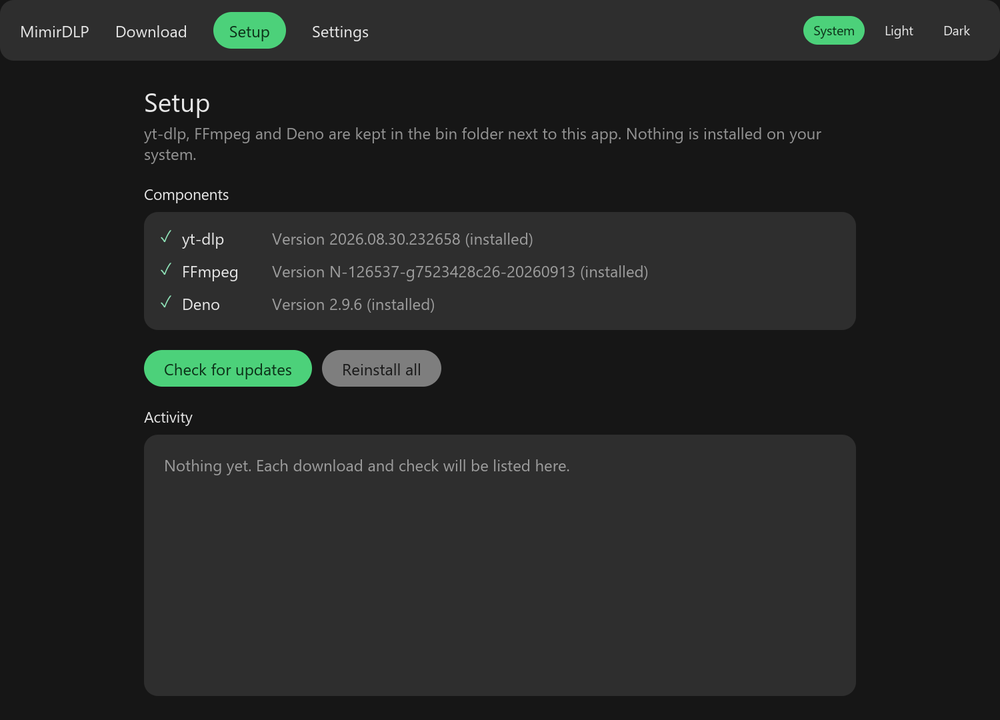
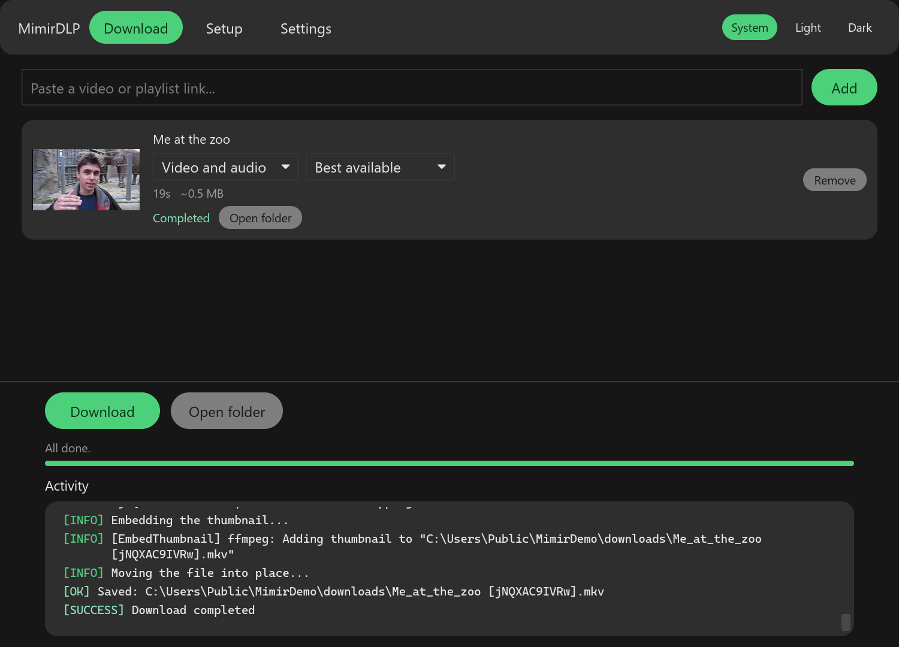
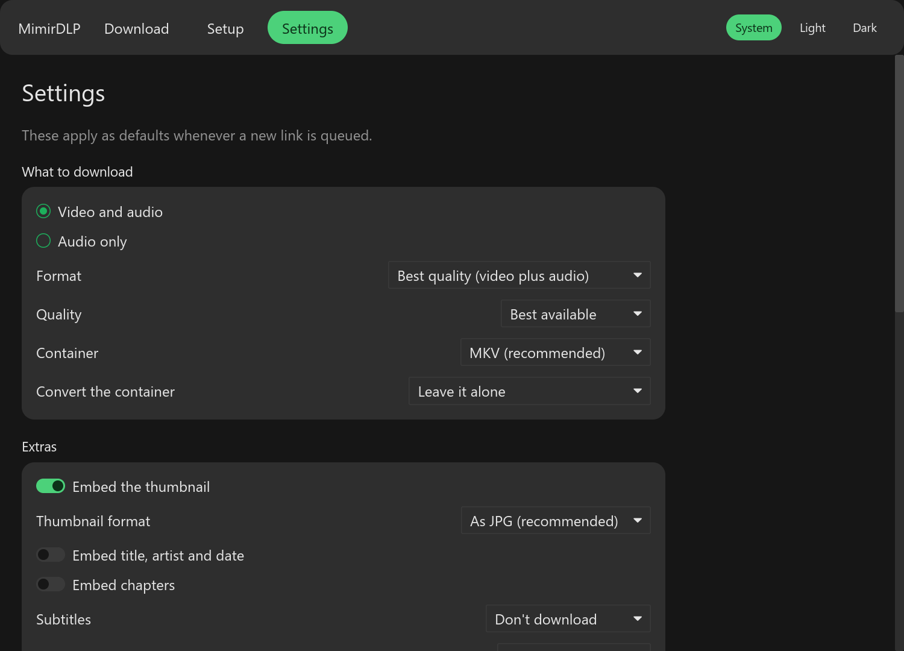
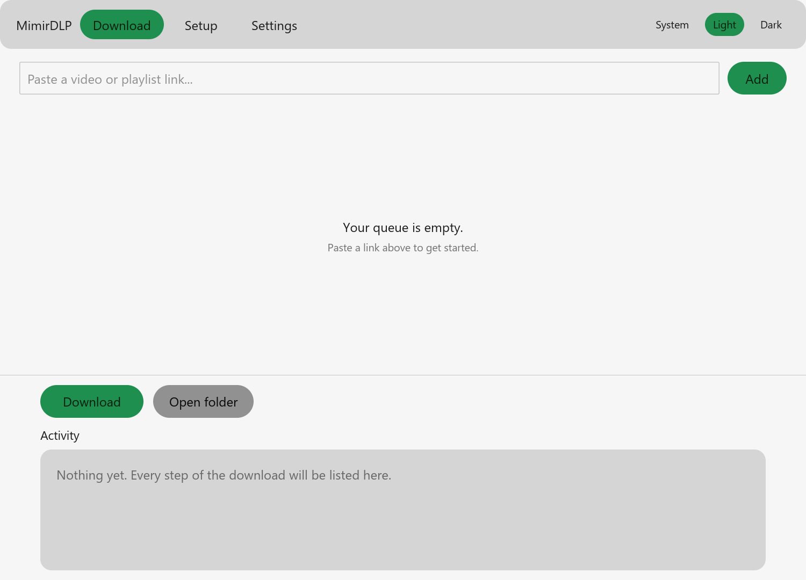

<div align="center">


# MimirDLP


A portable GUI around [yt-dlp](https://github.com/yt-dlp/yt-dlp) that doesn't touch your system.

</div>

In Norse mythology, Mimir guards a well of wisdom so deep that Odin gave up an eye just to drink from it. MimirDLP is a smaller trade: paste a link, and it goes and fetches the knowledge (and the video) for you, no sacrifice required.

## Features

- **Real preview before you commit**: pasting a link looks it up right away, title, thumbnail and duration included, so you know what you're about to get.
- **A real queue**: add as many links as you like, they download one after another, each with its own progress and its own quick format/quality pick.
- **Fully portable**: yt-dlp, FFmpeg and Deno live in a `bin/` folder next to the app. No installer, no admin/root rights, nothing added to your system or your PATH. Copy the folder anywhere and it still works.
- **Verified installs**: every binary is downloaded from its own official releases and checked against the published SHA256 before it's allowed to run.
- **Subtitles, thumbnails, metadata, chapters**: embed what you want, skip what you don't.
- **SponsorBlock**: mark sponsor segments as chapters, or cut them out of the file entirely.
- **Playlists**: grab the whole thing, just one video from it, or a specific range.
- **A history you control**: skip what you've already downloaded, stop as soon as something already in the history shows up, or just keep a plain download count.
- **Light and dark themes**, following your system by default.
- **Works on Windows and Linux**, from the same codebase, both covered by the same tests.

## Screenshots

| Setup | Download |
|---|---|
|  |  |

| Settings | Light theme |
|---|---|
|  |  |

## Download

Grab the latest build for your platform from the [Releases page](../../releases):

| Your computer | Download |
|---|---|
| Windows (x86_64) | `mimirdlp-<version>-windows-x86_64.zip` |
| Linux (x86_64) | `mimirdlp-<version>-linux-x86_64.tar.gz` |

Both come with a `.sha256` file alongside them, so you can check the download wasn't corrupted or tampered with before running it. Extract the archive anywhere and run `mimirdlp` (or `mimirdlp.exe` on Windows); there's no installer, and the whole folder is portable, so it works just as well from a USB stick as it does from `Program Files`.

## Getting it running

On first launch you land on **Setup**. Press "Install missing components" and every binary gets checksummed against what the upstream project publishes before it's allowed to run.

Come back to this screen any time to check for updates. It only re-downloads what's actually out of date, and yt-dlp comes from the nightly channel, since that's the one yt-dlp itself recommends for getting extractor fixes quickly.

## Downloading things

Works on YouTube, Twitch, and pretty much anywhere else yt-dlp does, which by now is most of the internet. Once every component shows installed, switch to the **Download** tab and paste a link. It's looked up right away and added to a queue as a card, where you can pick its format and quality without leaving the list. Add as many as you like, then press Download: they run one at a time, each with its own progress bar, and a finished card gets its own "Open folder" straight to that file.

Subtitles, thumbnails, SponsorBlock, file naming, and everything else that isn't shown on the card itself lives on the **Settings** tab, and applies to whatever you queue next. A summary of anything that would stop a download (an empty custom format string, an invalid SponsorBlock category list, that kind of thing) shows up before it starts, not after.

## SponsorBlock

You can have sponsor segments either marked as chapters, so you can skip them yourself, or cut straight out of the file. It uses the community database at [sponsor.ajay.app](https://sponsor.ajay.app), so it only does anything on YouTube.

Cutting is the interesting one: it really does re-cut the file, so an 18 minute video with a minute of sponsor reads comes out a minute shorter. By default the cuts are made without re-encoding, which is fast but can leave a small glitch right at the seam. There is an option to force keyframes at the cuts instead, which looks cleaner but re-encodes the whole video and takes much longer.

One caveat that comes from yt-dlp itself: if the SponsorBlock server can't be reached, the download fails instead of just skipping the segments. If that happens, turn SponsorBlock off and try again.

## A couple of things worth knowing

- Settings and the download history live next to the application (`mimirdlp.config`, `download_archive.txt`), not in `~/.config` or `%APPDATA%`, so the whole folder stays portable.
- Converting the container comes in two flavours. Remux just rewraps the existing streams, which is nearly instant but fails if the codecs don't fit the target container. Re-encode always works but is slow and costs some quality.
- Audio extraction is turned off when you pick a container conversion or a video format other than a custom string, and the other way around, since extracting audio throws away the video those would apply to.
- Thumbnails only fit in some file types. WAV can't hold one, so the thumbnail is simply skipped for it. When nothing else decides the container, a webm result is rewrapped into `.mkv` (or `.opus` for audio) so the thumbnail fits, without re-encoding anything.
- Everything yt-dlp itself already defaults to sensibly, this app leaves alone. The options here are the ones that are actually worth having an opinion about.

## When something goes wrong

- The Download tab is greyed out → go to Setup and install the missing components first.
- A component shows "Installed but not responding" → it downloaded but won't run (a corrupted download, or the wrong build for your machine); use "Install missing components" again to replace it.
- A download just fails → turn on Verbose in Settings, under Advanced, and read what yt-dlp actually says in the Activity log. Half the time it's a region lock or a site that wants a login.

## Building from source

Requires a current stable [Rust toolchain](https://rustup.rs).

```
cargo build --release
```

The binary lands in `target/release/`. Run it in place with `cargo run`; `YTP_APP_DIR=<dir> cargo run` points it at a scratch folder instead of the executable's own directory, which is convenient during development.

## Contributing

Issues and pull requests are welcome. If you're changing behaviour rather than fixing a typo, `cargo fmt --check`, `cargo clippy --all-targets --locked -- -D warnings` and `cargo test --all-targets --locked` should all pass first; these are exactly the checks CI runs on every push.

## License and disclaimer

MimirDLP is distributed under the [MIT license](LICENSE). yt-dlp, FFmpeg, and Deno bring their own licenses along with them.

Use this application responsibly. The maintainers cannot be held liable for misuse of this application. This project does not condone using it to violate local laws or a platform's terms of service. You are responsible for how you use it.
